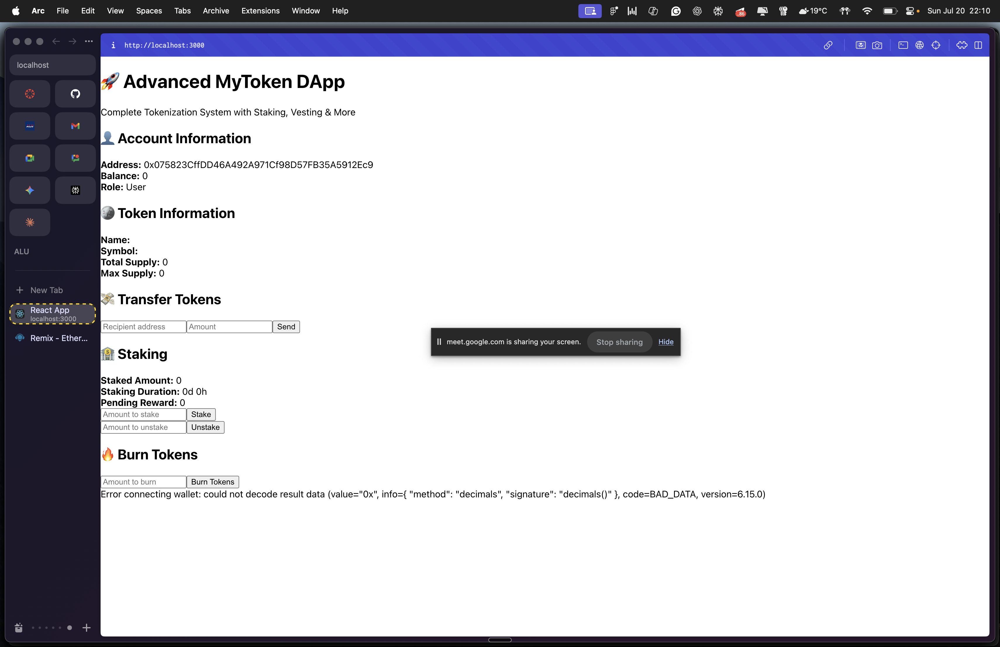

# 🚀 DApp-ALU: Advanced ERC-20 Token Ecosystem

A comprehensive decentralized application (DApp) featuring a full-stack tokenization system built with Solidity smart contracts and React frontend. This project demonstrates advanced blockchain development concepts including staking, vesting, access control, and more.

## 🌟 Advanced Features

### 🔐 Smart Contract Features
- **ERC-20 Standard Compliance**: Full ERC-20 implementation with OpenZeppelin
- **Mintable & Burnable**: Controlled token supply management
- **Pausable**: Emergency stop functionality
- **Access Control**: Owner and minter role management
- **Blacklist System**: Account restriction capabilities
- **Transfer Fees**: Configurable transaction fees (0-5%)
- **Supply Cap**: Maximum supply limit (100M tokens)
- **Reentrancy Protection**: Security against reentrancy attacks

### 🏦 Advanced Tokenization Features
- **Token Staking**: Earn rewards for locking tokens
- **Vesting Schedules**: Time-locked token releases
- **Batch Operations**: Efficient multi-recipient transactions
- **EIP-2612 Permit**: Gasless approvals
- **Emergency Functions**: Admin recovery mechanisms

### 💻 Frontend Features
- **MetaMask Integration**: Seamless wallet connection
- **Multi-Function Interface**: Complete token management UI
- **Real-time Updates**: Live balance and transaction status
- **Responsive Design**: Mobile-first approach
- **Modern UI/UX**: Beautiful gradient design with animations

## 🛠️ Tech Stack

**Smart Contracts:**
- Solidity ^0.8.20
- OpenZeppelin Contracts v5.3.0
- Hardhat Development Framework
- Ethers.js v6 for blockchain interaction

**Frontend:**
- React 19.1.0 with Hooks
- Ethers.js v6 for Web3 integration
- Modern CSS with animations
- Responsive grid layouts

**Development & Testing:**
- Comprehensive test suite (35+ tests)
- Gas optimization reporting
- Frontend component testing
- Integration testing

## 📋 Prerequisites

Before you begin, ensure you have:

- [Node.js](https://nodejs.org/) (v16 or higher) & npm
- [MetaMask](https://metamask.io/) browser extension
- Sepolia testnet ETH ([get from faucet](https://sepoliafaucet.com/))
- Code editor (VS Code recommended)
- Basic understanding of blockchain concepts

## 🚀 Quick Start Guide

### 1. Clone and Install Dependencies

```bash
git clone https://github.com/kingdavidch/DApp-ALU.git
cd DApp-ALU
npm install
cd frontend && npm install && cd ..
```

### 2. Environment Setup

Create a `.env` file in the root directory:

```bash
cp .env.example .env
```

Edit `.env` with your values:
```env
SEPOLIA_RPC_URL=https://sepolia.infura.io/v3/YOUR_PROJECT_ID
PRIVATE_KEY=your_wallet_private_key_here
```

> ⚠️ **Security Note**: Never commit your private key to version control. Use a test wallet only.

### 3. Smart Contract Development & Testing

#### Compile Contracts
```bash
npx hardhat compile
```

#### Run Comprehensive Tests
```bash
npx hardhat test
```

Expected output: ✅ **35 passing tests** covering all features

#### Deploy to Local Network (for testing)
```bash
npx hardhat run scripts/deploy.js
```

#### Deploy to Sepolia Testnet
```bash
npx hardhat run scripts/deploy.js --network sepolia
```

**Save the deployed contract address!** You'll need it for the frontend.

### 4. Frontend Configuration & Launch

#### Update Contract Address
Edit `frontend/src/App.js` and replace:
```javascript
const CONTRACT_ADDRESS = "YOUR_CONTRACT_ADDRESS_HERE";
```
with your deployed contract address.

#### Run Frontend Tests
```bash
cd frontend && npm test -- --watchAll=false
```

#### Start Development Server
```bash
npm start
```

Visit [http://localhost:3000](http://localhost:3000) to interact with your DApp!

## � Screenshots


*Complete tokenization system interface showing wallet connection, token information, staking, and token management features*

## �📱 DApp Usage Guide

### 🔌 Connect Your Wallet
1. Click "Connect Wallet" 
2. Approve MetaMask connection
3. Ensure you're on Sepolia testnet

### 💰 Basic Token Operations
- **View Balance**: Automatically displayed after connection
- **Transfer Tokens**: Send tokens to any address
- **Burn Tokens**: Permanently destroy your tokens

### 🏦 Advanced Features

#### Staking (Earn Rewards)
1. Enter amount to stake
2. Click "Stake" and confirm transaction
3. Earn 1% annual rewards automatically
4. Unstake anytime with accumulated rewards

#### Vesting (Time-locked Tokens)
- View your vesting schedule (if any)
- Release vested tokens when available
- Track vesting progress

#### Admin Functions (Contract Owner/Minters)
- **Mint Tokens**: Create new tokens (within supply cap)
- **Pause/Unpause**: Emergency stop functionality
- **Manage Blacklist**: Restrict problematic accounts

## 🧪 Testing Results

### Smart Contract Tests
```
✅ 35 passing tests (521ms)
  - Deployment & Configuration: 4 tests
  - Minting Operations: 4 tests  
  - Burning & Pausing: 2 tests
  - Transfer Fees: 2 tests
  - Blacklist System: 3 tests
  - Staking Mechanism: 3 tests
  - Vesting System: 3 tests
  - Access Control: 2 tests
  - Emergency Functions: 1 test
  - ERC20Permit: 1 test
  - Integration Tests: 1 test
```

### Gas Usage Analysis
- Contract Deployment: ~5M gas (optimized)
- Token Transfer: ~66k gas average
- Staking Operations: ~123k gas average
- Vesting Operations: ~150k gas average

## 📁 Project Architecture

```
DApp-ALU/
├── contracts/
│   ├── MyToken.sol          # Advanced ERC-20 token with all features
│   └── Lock.sol             # Time-locked contract example
├── frontend/
│   ├── src/
│   │   ├── App.js           # Main React DApp interface
│   │   ├── App.css          # Modern responsive styling
│   │   └── App.test.js      # Frontend component tests
│   └── package.json         # Frontend dependencies
├── test/
│   ├── MyToken.js           # Comprehensive contract tests
│   └── Lock.js              # Lock contract tests
├── scripts/
│   └── deploy.js            # Deployment script with configuration
├── hardhat.config.js        # Hardhat & network configuration
├── .env.example             # Environment variables template
└── README.md               # This comprehensive guide
```

## 🔧 Advanced Configuration

### Network Configuration
The project supports multiple networks. To add custom networks, modify `hardhat.config.js`:

```javascript
networks: {
  sepolia: {
    url: SEPOLIA_RPC_URL,
    accounts: PRIVATE_KEY ? [PRIVATE_KEY] : [],
  },
  mainnet: {
    url: MAINNET_RPC_URL,
    accounts: PRIVATE_KEY ? [PRIVATE_KEY] : [],
  }
}
```

### Token Customization
Key contract parameters in `MyToken.sol`:
- **Max Supply**: 100,000,000 tokens
- **Max Transfer Fee**: 5%
- **Staking Reward Rate**: 1% annually (adjustable)
- **Token Name**: "Advanced MyToken"
- **Token Symbol**: "AMTK"

## 🚨 Troubleshooting Guide

### Common Issues & Solutions

**MetaMask Connection Failed**
```
Solution: Ensure MetaMask is installed, unlocked, and on Sepolia network
```

**Transaction Failed**
```
Solution: Check gas fees, account balance, and contract address
```

**Tests Failing**
```
Solution: Run 'npm install' and ensure Node.js v16+
```

**Contract Deployment Error**
```
Solution: Verify .env file setup and account has ETH for gas
```

### Debug Commands
```bash
# Check Hardhat networks
npx hardhat help

# Verify contract on Etherscan
npx hardhat verify --network sepolia DEPLOYED_ADDRESS "1000000000000000000000000" "OWNER_ADDRESS"

# Check account balance
npx hardhat run scripts/check-balance.js --network sepolia
```

## 🔒 Security Features

- **Reentrancy Protection**: All external calls protected
- **Access Control**: Role-based permissions
- **Input Validation**: Comprehensive parameter checking  
- **Emergency Stops**: Pausable functionality
- **Supply Controls**: Hard cap on token creation
- **Blacklist System**: Malicious account protection

## 📈 Gas Optimization

The contract is optimized for gas efficiency:
- Batch operations for multiple transfers
- Efficient storage patterns
- Minimal external calls
- Optimized loop structures

## 🤝 Contributing

1. Fork the repository
2. Create a feature branch (`git checkout -b feature/amazing-feature`)
3. Commit your changes (`git commit -m 'Add amazing feature'`)
4. Push to the branch (`git push origin feature/amazing-feature`)
5. Open a Pull Request

## 📄 License

This project is licensed under the MIT License - see the [LICENSE](LICENSE) file for details.

## 🙏 Acknowledgments

- [OpenZeppelin](https://openzeppelin.com/) for secure smart contract libraries
- [Hardhat](https://hardhat.org/) for the excellent development framework
- [React](https://reactjs.org/) for the powerful frontend framework
- [Ethers.js](https://docs.ethers.io/) for seamless blockchain interaction

## 📞 Support & Resources

- **GitHub Issues**: [Report bugs or request features](https://github.com/kingdavidch/DApp-ALU/issues)
- **Documentation**: [Hardhat Docs](https://hardhat.org/docs)
- **Learning**: [Ethereum Development Resources](https://ethereum.org/developers)
- **Community**: [OpenZeppelin Forum](https://forum.openzeppelin.com/)

---

**🎉 Congratulations! You now have a complete, production-ready tokenization system!**

*Built with ❤️ for the blockchain community*

Visit [http://localhost:3000](http://localhost:3000) to interact with your DApp!

## 📱 How to Use the DApp

1. **Connect Wallet**: Click "Connect Wallet" and approve MetaMask connection
2. **Switch Network**: Ensure MetaMask is on Sepolia testnet
3. **View Balance**: Your MTK token balance will display automatically
4. **Transfer Tokens**: 
   - Enter recipient address
   - Specify amount to transfer
   - Click "Send" and confirm transaction in MetaMask

## 🧪 Testing

### Smart Contract Tests
```bash
npx hardhat test
```

Tests cover:
- Token deployment and initial supply
- Transfer functionality
- Balance updates
- Access controls

### Frontend Tests
```bash
cd frontend && npm test -- --watchAll=false
```

Tests verify:
- Component rendering
- UI element presence
- User interaction flows

## 📁 Project Structure

```
DApp-ALU/
├── contracts/
│   ├── MyToken.sol          # ERC-20 token contract
│   └── Lock.sol             # Time-locked contract
├── frontend/
│   ├── src/
│   │   ├── App.js           # Main React component
│   │   ├── App.test.js      # Frontend tests
│   │   └── ...
│   └── package.json
├── scripts/
│   └── deploy.js            # Deployment script
├── test/
│   ├── MyToken.js           # Token contract tests
│   └── Lock.js              # Lock contract tests
├── hardhat.config.js        # Hardhat configuration
└── package.json
```

## 🔧 Configuration

### Network Configuration
The project is configured for Sepolia testnet. To add other networks, modify `hardhat.config.js`:

```javascript
networks: {
  sepolia: {
    url: SEPOLIA_RPC_URL,
    accounts: PRIVATE_KEY ? [PRIVATE_KEY] : [],
  },
  // Add other networks here
}
```

### Token Configuration
Customize your token in `contracts/MyToken.sol`:
- Token name: "MyToken"
- Symbol: "MTK"
- Initial supply: Set during deployment

## 🚨 Troubleshooting

**Common Issues:**

1. **MetaMask Connection Failed**
   - Ensure MetaMask is installed and unlocked
   - Check if you're on the correct network (Sepolia)

2. **Transaction Failed**
   - Verify you have sufficient ETH for gas fees
   - Check if contract address is correctly configured

3. **Tests Failing**
   - Run `npm install` to ensure all dependencies are installed
   - Check Node.js version compatibility

## 🤝 Contributing

1. Fork the repository
2. Create a feature branch (`git checkout -b feature/amazing-feature`)
3. Commit your changes (`git commit -m 'Add amazing feature'`)
4. Push to the branch (`git push origin feature/amazing-feature`)
5. Open a Pull Request

## 📄 License

This project is licensed under the MIT License - see the [LICENSE](LICENSE) file for details.

## 🙏 Acknowledgments

- [OpenZeppelin](https://openzeppelin.com/) for secure smart contract libraries
- [Hardhat](https://hardhat.org/) for the excellent development framework
- [React](https://reactjs.org/) for the frontend framework
- [Ethers.js](https://docs.ethers.io/) for blockchain interaction

## 📞 Support

If you have questions or need help:
- Open an issue on GitHub
- Check the [Hardhat documentation](https://hardhat.org/docs)
- Visit [Ethereum development resources](https://ethereum.org/developers)

---

**Happy Building! 🎉**
